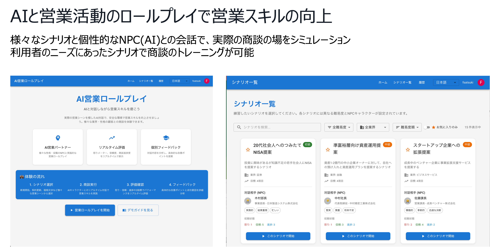
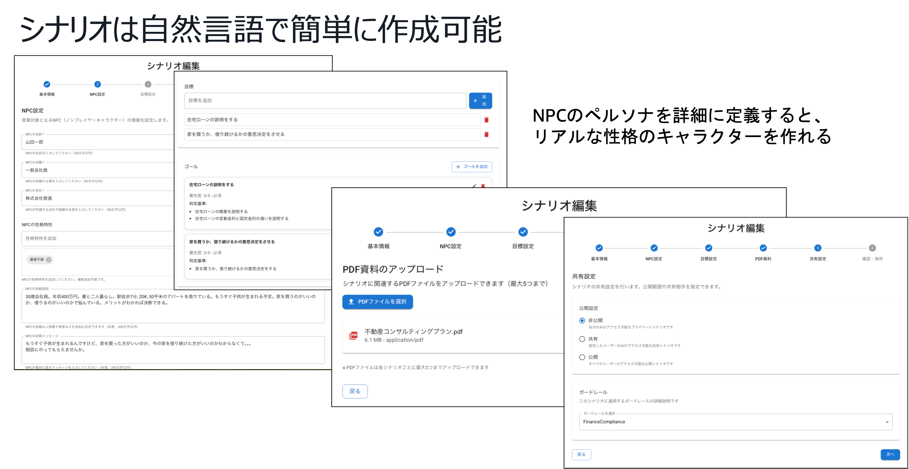
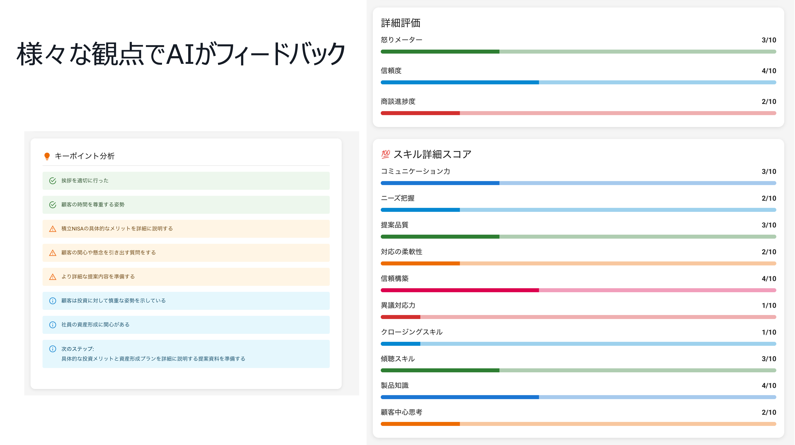
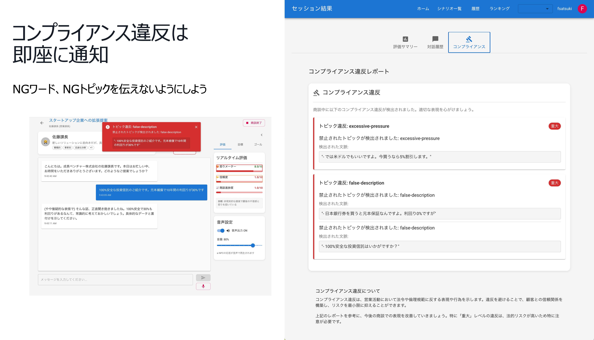
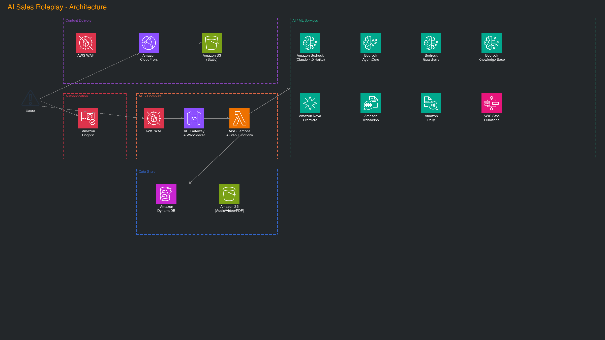

# AI営業ロールプレイ

## 概要
生成AIを活用した営業スキル向上のためのロールプレイングシステムです。感情表現豊かなAIとの音声対話を通じて、実践的な営業スキルを身につけることができます。
若手営業担当者を対象に、AIとのインタラクティブなシミュレーションを通じて営業スキルの向上を図るシステムです。

### 主要機能

- **AIとの音声対話**: Amazon Bedrockを活用した自然な会話
- **リアルタイム感情フィードバック**: 怒りメーター、信頼度、進捗度の可視化
- **多様なシナリオ**: カスタマイズ可能な営業シーン
- **詳細な分析レポート**: セッション後の改善提案とフィードバック
- **対話中の映像分析**: セッション中の映像を分析して、効果的なアイコンタクトや身振り手振りができているか検証
- **コンプライアンス違反チェック**: コンプライアンスに違反する発言を指摘
- **リファレンスチェック**: ユーザーの発言がリファレンス(根拠資料)に準拠しているか検証

### 画面イメージ






### 技術スタック

**フロントエンド**
- React 19 + TypeScript
- Material UI 7
- Vite 6（ビルドツール）
- AWS Amplify v6（認証）
- React Context API（状態管理）

**バックエンド**
- AWS CDK（インフラストラクチャ）
- AWS Lambda (Python 3.13) + API Gateway
- Amazon Bedrock (Claude 3.5 Haiku)
- Amazon Polly（音声合成）
- Amazon Bedrock Guardrails（コンプライアンスチェック）
- DynamoDB + RDS PostgreSQL
- Amazon S3（PDF資料、音声ファイル）
- Amazon Cognito（認証）

### アーキテクチャ


## セットアップ

### 前提条件

- Docker
- Node.js 22.x以上
- Python 3.12以上
- AWS CLI最新版
- AWS CDK最新版

### デプロイ方法

#### AWS CloudShellを使った簡単デプロイ

事前準備不要で、AWS CloudShellを使って簡単にデプロイできます：

1. **AWS コンソールにログイン**して、画面上部のCloudShellアイコン（ターミナルマーク）をクリックします

2. **以下のコマンドを実行**
```bash
# リポジトリをクローン
git clone https://github.com/aws-samples/sample-ai-sales-roleplay.git
cd sample-ai-sales-roleplay

# デプロイスクリプトを実行
chmod +x bin.sh
./bin.sh
```

3. **デプロイオプション**（任意）
```bash
# セルフサインアップ機能を無効化
./bin.sh --disable-self-register

# 別のBedrockリージョンを使用
./bin.sh --bedrock-region us-west-2

# 詳細なカスタマイズ
./bin.sh --cdk-json-override '{"context":{"allowedSignUpEmailDomains":["example.com"]}}'
```

4. **デプロイ完了後、表示されるURLからアプリケーションにアクセスできます**

#### 手動インストール

1. **リポジトリのクローン**
```bash
git clone https://github.com/aws-samples/sample-ai-sales-roleplay.git
cd sample-ai-sales-roleplay
```

2. **依存関係のインストール**
```bash
# フロントエンド
cd frontend
npm install

# バックエンド
cd ../cdk
npm install
```

3. **環境構築**
[AI営業ロールプレイの環境構築](./cdk/README.md) を参照

## ドキュメント

### 機能仕様
- [シナリオ作成ガイド](docs/scenario-creation.md)
- [動画分析機能](docs/video-analysis.md)

### API・技術仕様
- [Polly Lexiconガイド](docs/custom-resources/polly-lexicon-guide.md)

### 運用・コスト
- [コスト試算](docs/cost/コスト試算.md)

## プロジェクト構造

```
├── frontend/                    # Reactアプリケーション
│   ├── src/
│   │   ├── components/         # UIコンポーネント
│   │   ├── pages/              # アプリケーションページ
│   │   ├── services/           # APIサービス、認証等
│   │   ├── hooks/              # カスタムReactフック
│   │   ├── types/              # TypeScript型定義
│   │   ├── utils/              # ユーティリティ関数
│   │   ├── i18n/               # 国際化設定
│   │   └── config/             # 設定ファイル
│   └── docs/                   # フロントエンド固有ドキュメント
├── cdk/                        # AWS CDKインフラコード
│   ├── lib/
│   │   ├── constructs/         # 再利用可能なCDKコンストラクト
│   │   │   ├── api/            # API Gateway関連
│   │   │   ├── storage/        # S3、DynamoDB関連
│   │   │   └── compute/        # Lambda関連
│   │   └── stacks/             # デプロイ可能なスタック
│   ├── lambda/                 # Lambda関数実装
│   │   ├── bedrock/            # Amazon Bedrock連携
│   │   ├── scoring/            # スコアリングエンジン
│   │   ├── textToSpeech/       # 音声合成
│   │   ├── scenarios/          # シナリオ管理
│   │   ├── sessions/           # セッション管理
│   │   ├── guardrails/         # Guardrails管理
│   │   ├── rankings/           # ランキング機能
│   │   └── videos/             # 動画処理
│   └── data/                   # 初期データ（シナリオ、Guardrails設定）
├── docs/                       # プロジェクトドキュメント
│   ├── api/                    # API仕様書
│   ├── cost/                   # コスト試算
│   ├── custom-resources/       # カスタムリソースガイド
│   └── features/               # 機能仕様書
└── .kiro/                      # Kiro AI設定ファイル
```

## Security

See [CONTRIBUTING](CONTRIBUTING.md#security-issue-notifications) for more information.

## License

This library is licensed under the MIT-0 License. See the LICENSE file.
