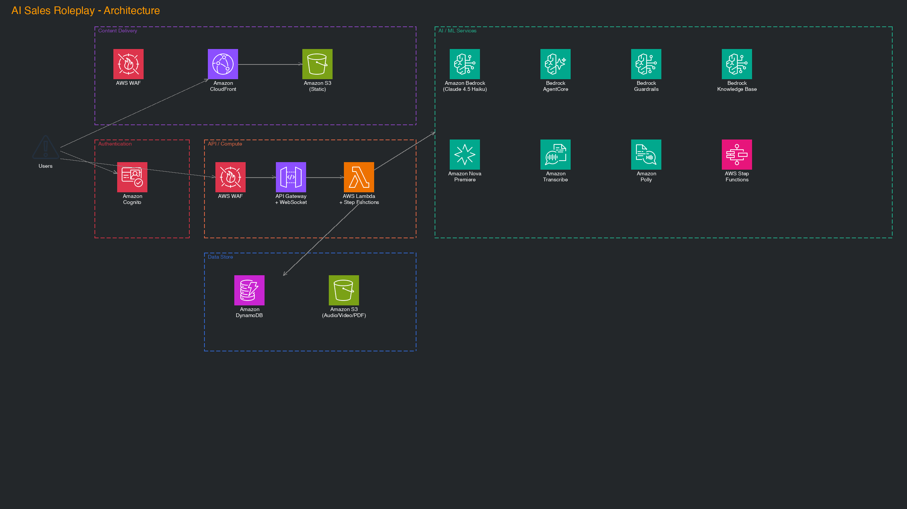

# AI Sales Roleplay

## Overview
A roleplay system for improving sales skills using generative AI. Users can develop practical sales skills through voice-based conversations with emotionally expressive AI.
This system is designed for junior sales representatives, helping them improve their sales skills through interactive simulations with AI.

### Key Features

- **Voice Conversation with AI**: Natural conversations powered by Amazon Bedrock AgentCore Runtime
- **3D Avatar**: VRM model-based NPC display with lip sync, emotion-driven expressions, and gesture animations
- **Real-time Speech Recognition**: Real-time voice recognition via Amazon Transcribe Streaming (WebSocket)
- **Real-time Emotional Feedback**: Visualization of anger meter, trust level, and progress
- **Text-to-Speech**: Natural speech with Amazon Polly (SSML support), per-scenario voice model selection
- **Diverse Scenarios**: Customizable sales scenes with VRM avatar upload support
- **Detailed Analysis Reports**: Improvement suggestions and feedback after each session
- **Video Analysis During Conversation**: Gaze, expression, and gesture analysis with Amazon Nova Premiere
- **Compliance Violation Check**: Real-time violation detection with Amazon Bedrock Guardrails
- **Reference Check**: Reference material accuracy evaluation using Amazon Bedrock Knowledge Base
- **Ranking**: Performance comparison between users for motivation
- **Internationalization**: Japanese and English multilingual support

### Screenshots


### Technology Stack

**Frontend**
- React 19 + TypeScript 5.9
- Material UI 7
- Vite 7 (Build tool)
- AWS Amplify v6 (Authentication)
- React Context API (State management)
- three.js + @pixiv/three-vrm (3D Avatar)
- i18next + react-i18next (Internationalization)
- Chart.js + react-chartjs-2 (Data visualization)
- React Router DOM 7 (Routing)
- Jest 30 + React Testing Library + Playwright (Testing)

**Backend**
- AWS CDK 2.x (Infrastructure as Code)
- Amazon Bedrock AgentCore Runtime (AI agent execution platform)
- AWS Lambda (Python 3.9 / TypeScript) + API Gateway (REST + WebSocket)
- Amazon Bedrock (Claude 4.5 Haiku)
- Amazon Nova Premiere (Video analysis)
- Amazon Polly (Text-to-speech with SSML)
- Amazon Transcribe Streaming (Real-time speech recognition via WebSocket)
- Amazon Bedrock Guardrails (Compliance check)
- Amazon Bedrock Knowledge Base (PDF reference evaluation)
- DynamoDB + RDS PostgreSQL
- Amazon S3 (PDF materials, audio files, video recordings, VRM avatars)
- Amazon CloudFront (Static delivery + VRM file delivery)
- Amazon Cognito (Authentication)
- CDK Nag (Security checks)

### Architecture


## Setup

### Prerequisites

- Docker
- Node.js 22.x or higher
- Python 3.12 or higher
- Latest AWS CLI
- Latest AWS CDK

### Deployment

#### Quick Deployment with AWS CloudShell

You can easily deploy without any prerequisites using AWS CloudShell:

1. **Log in to AWS Console** and click the CloudShell icon (terminal mark) at the top of the screen

2. **Run the following commands**
```bash
# Clone the repository
git clone https://github.com/aws-samples/sample-ai-sales-roleplay.git
cd sample-ai-sales-roleplay

# Run deployment script
chmod +x bin.sh
./bin.sh
```

3. **Deployment Options** (optional)
```bash
# Disable self-registration feature
./bin.sh --disable-self-register

# Use a different region
export AWS_DEFAULT_REGION=ap-northeast-1
./bin.sh

# Specify individual models
./bin.sh --conversation-model "global.anthropic.claude-sonnet-4-5-20250929-v1:0"

# Detailed customization
./bin.sh --cdk-json-override '{"context":{"default":{"allowedSignUpEmailDomains":["example.com"]}}}'
```

4. **After deployment completes, you can access the application from the displayed URL**

#### Manual Installation

1. **Clone the repository**
```bash
git clone https://github.com/aws-samples/sample-ai-sales-roleplay.git
cd sample-ai-sales-roleplay
```

2. **Install dependencies**
```bash
# Frontend
cd frontend
npm install

# Backend
cd ../cdk
npm install
```

3. **Environment Setup**
Refer to [AI Sales Roleplay Environment Setup](./cdk/README.md) (Japanese)

## Documentation

### Deployment & Configuration
- [bin.sh Deployment Script Reference](docs/deployment/bin-sh-reference.md) (Japanese)

### Feature Specifications
- [Scenario Creation Guide](docs/scenario-creation.md) (Japanese)
- [Video Analysis Feature](docs/video-analysis.md) (Japanese)

### API & Technical Specifications
- [Polly Lexicon Guide](docs/custom-resources/polly-lexicon-guide.md) (Japanese)

### Operations & Cost
- [Cost Estimation](docs/cost/コスト試算.md) (Japanese)

*Note: Most documentation is currently in Japanese. English translations are planned for future updates.*

## Project Structure

```
├── frontend/                    # React application
│   ├── src/
│   │   ├── components/         # UI components
│   │   │   ├── avatar/         # 3D avatar (VRM display, lip sync, expressions, gestures)
│   │   │   ├── conversation/   # Conversation screen components
│   │   │   ├── compliance/     # Compliance related
│   │   │   ├── recording/      # Recording related
│   │   │   ├── referenceCheck/ # Reference check
│   │   │   └── common/         # Common components
│   │   ├── pages/              # Application pages
│   │   ├── services/           # API services, authentication, etc.
│   │   ├── hooks/              # Custom React hooks
│   │   ├── types/              # TypeScript type definitions
│   │   ├── utils/              # Utility functions
│   │   ├── i18n/               # Internationalization (Japanese & English)
│   │   └── config/             # Configuration files
│   └── docs/                   # Frontend-specific documentation
├── cdk/                        # AWS CDK infrastructure code
│   ├── lib/
│   │   ├── constructs/         # Reusable CDK constructs
│   │   │   ├── api/            # API Gateway related
│   │   │   ├── storage/        # S3, DynamoDB related
│   │   │   └── compute/        # Lambda related
│   │   └── stacks/             # Deployable stacks
│   ├── agents/                 # Bedrock AgentCore agent definitions
│   │   ├── npc-conversation/   # NPC conversation agent
│   │   ├── realtime-scoring/   # Real-time scoring agent
│   │   ├── audio-analysis/     # Audio analysis agent
│   │   ├── feedback-analysis/  # Feedback analysis agent
│   │   └── video-analysis/     # Video analysis agent
│   ├── lambda/                 # Lambda function implementations
│   │   ├── agentcore-api/      # AgentCore Runtime API integration
│   │   ├── evaluation-api/     # Evaluation API
│   │   ├── scoring/            # Scoring engine
│   │   ├── textToSpeech/       # Text-to-speech (SSML support)
│   │   ├── transcribeWebSocket/ # Speech recognition WebSocket
│   │   ├── scenarios/          # Scenario management
│   │   ├── sessions/           # Session management
│   │   ├── sessionAnalysis/    # Session analysis
│   │   ├── audioAnalysis/      # Audio analysis
│   │   ├── guardrails/         # Guardrails management
│   │   ├── rankings/           # Ranking features
│   │   ├── videos/             # Video processing (Nova Premiere)
│   │   ├── avatars/            # Avatar management (VRM upload)
│   │   └── custom-resources/   # Custom resource management
│   └── data/                   # Initial data (scenarios, Guardrails config)
├── docs/                       # Project documentation
│   ├── cost/                   # Cost estimation
│   ├── custom-resources/       # Custom resource guides
│   ├── deployment/             # Deployment guides
│   └── image/                  # Screenshots & architecture diagrams
└── .kiro/                      # Kiro AI configuration files
```

## Security

See [CONTRIBUTING](CONTRIBUTING.md#security-issue-notifications) for more information.

## License

This library is licensed under the MIT-0 License. See the LICENSE file.
