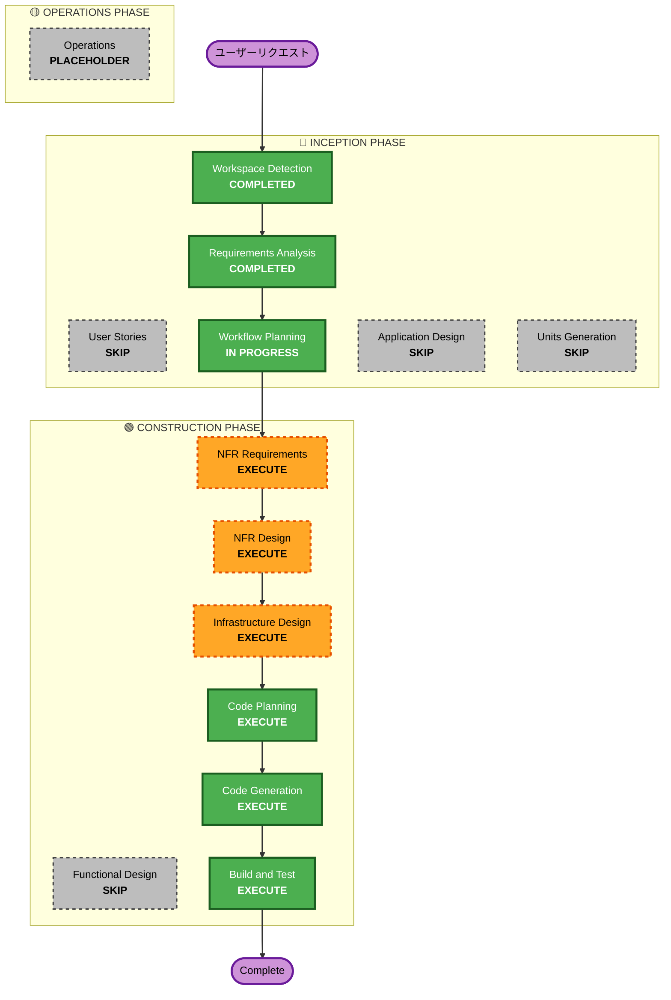

# Nova 2 Sonic移行 - 実行計画書

## Detailed Analysis Summary

### Transformation Scope
- **Transformation Type**: Architectural（音声認識 + NPC対話生成の基盤変更）
- **Primary Changes**: Transcribe Streaming + Claude NPC会話 → Nova 2 Sonic BidiAgent
- **Related Components**: フロントエンド音声サービス、AgentCore Runtime、CDKインフラ、コスト試算ドキュメント

### Change Impact Assessment
- **User-facing changes**: Yes - 音声認識・対話生成の応答品質・レイテンシーが変化する可能性
- **Structural changes**: Yes - WebSocket接続先がAPI Gateway → AgentCore Runtime WebSocketに変更
- **Data model changes**: No - AgentCore Memory、DynamoDBのデータモデルは変更なし
- **API changes**: Yes - フロントエンドの接続先がAgentCore Runtime WebSocket(/ws)に変更、Transcribe WebSocket API廃止
- **NFR impact**: Yes - レイテンシー要件、8分セッション制限対応、日本語ASR精度

### Component Relationships
```
## Component Relationships
- **Primary Component**: AgentCore Runtime (nova-sonic BidiAgent) [新規]
- **Infrastructure Components**: CDK constructs (transcribe-websocket.ts 廃止、nova-sonic Runtime追加)
- **Shared Components**: フロントエンド型定義、AgentCoreService
- **Dependent Components**: ConversationPage、AudioService、PollyService（変更なし）
- **Supporting Components**: コスト試算ドキュメント
```

### Risk Assessment
- **Risk Level**: High
- **Rollback Complexity**: Moderate（ビッグバン移行だが、旧コードはGit履歴に残る）
- **Testing Complexity**: Complex（日本語ASR精度、Session Continuation、SigV4認証）

---

## Workflow Visualization

### Mermaid Diagram



### Text Alternative
```
Phase 1: INCEPTION
  - Workspace Detection (COMPLETED)
  - Requirements Analysis (COMPLETED)
  - User Stories (SKIP)
  - Workflow Planning (IN PROGRESS)
  - Application Design (SKIP)
  - Units Generation (SKIP)

Phase 2: CONSTRUCTION
  - NFR Requirements (EXECUTE)
  - NFR Design (EXECUTE)
  - Infrastructure Design (EXECUTE)
  - Functional Design (SKIP)
  - Code Planning (EXECUTE)
  - Code Generation (EXECUTE)
  - Build and Test (EXECUTE)

Phase 3: OPERATIONS
  - Operations (PLACEHOLDER)
```

---

## Phases to Execute

### 🔵 INCEPTION PHASE
- [x] Workspace Detection (COMPLETED)
- [x] Reverse Engineering (SKIPPED - 既存成果物あり)
- [x] Requirements Analysis (COMPLETED - 13 FR + 8 NFR承認済み)
- [x] User Stories (SKIPPED)
- [x] Workflow Planning (IN PROGRESS)
- [ ] Application Design - **SKIP**
  - **Rationale**: 新規コンポーネントはNovaSonicService（TranscribeServiceの置き換え）とAgentCore Runtime BidiAgent（既存NPC会話Runtimeの置き換え）のみ。既存コンポーネントの1対1置き換えであり、コンポーネント間の依存関係やインターフェースは要件定義書で十分に定義済み。
- [ ] Units Generation - **SKIP**
  - **Rationale**: 単一ユニットの移行作業。フロントエンド + バックエンド + インフラを一体として実装する。

### 🟢 CONSTRUCTION PHASE
- [ ] Functional Design - **SKIP**
  - **Rationale**: ビジネスロジックの変更なし。NPC対話生成のモデル変更（Claude → Nova 2 Sonic）であり、スコアリング・フィードバック・ゴール管理等のビジネスルールは変更なし。
- [ ] NFR Requirements - **EXECUTE**
  - **Rationale**: Nova 2 Sonicの8分セッション制限、Session Continuation、日本語非公式サポート、SigV4認証、AgentCore Runtimeコンテナ設定など、重要なNFR要件の詳細化が必要。技術スタック決定（Strands BidiAgent experimental、コンテナサイズ、スケーリング設定）も含む。
- [ ] NFR Design - **EXECUTE**
  - **Rationale**: Session Continuationの設計パターン（SessionTransitionManager、音声バッファリング、セッション切り替えロジック）、エラーハンドリングパターン（ModelTimeoutException、接続切断リカバリ）、SigV4認証フローの詳細設計が必要。
- [ ] Infrastructure Design - **EXECUTE**
  - **Rationale**: AgentCore Runtime nova-sonic BidiAgentの新規デプロイ、Transcribe WebSocketインフラの廃止、CDKコンストラクトの追加・削除、Cognito Identity Pool設定（SigV4認証用）など、インフラ変更が大きい。
- [ ] Code Planning - **EXECUTE** (ALWAYS)
  - **Rationale**: 実装ステップの詳細計画が必要
- [ ] Code Generation - **EXECUTE** (ALWAYS)
  - **Rationale**: コード実装が必要
- [ ] Build and Test - **EXECUTE** (ALWAYS)
  - **Rationale**: ビルド、テスト、検証が必要

### 🟡 OPERATIONS PHASE
- [ ] Operations - **PLACEHOLDER**
  - **Rationale**: 将来のデプロイ・監視ワークフロー

---

## Estimated Timeline
- **Total Stages to Execute**: 6（NFR Requirements, NFR Design, Infrastructure Design, Code Planning, Code Generation, Build and Test）
- **Total Stages to Skip**: 5（User Stories, Application Design, Units Generation, Functional Design）
- **Estimated Duration**: 4-6時間
  - NFR Requirements: 30-45分
  - NFR Design: 30-45分
  - Infrastructure Design: 30-45分
  - Code Planning: 15-30分
  - Code Generation: 1.5-2.5時間
  - Build and Test: 30-60分

---

## Success Criteria
- **Primary Goal**: Transcribe Streaming + Claude NPC会話をNova 2 Sonic BidiAgentに完全移行
- **Key Deliverables**:
  - NovaSonicService（フロントエンド）
  - AgentCore Runtime nova-sonic BidiAgent（バックエンド）
  - SessionTransitionManager（8分セッション制限対応）
  - CDKインフラ更新（Transcribe WebSocket廃止、nova-sonic Runtime追加）
  - コスト試算ドキュメント更新
- **Quality Gates**:
  - TypeScript型エラーゼロ
  - ESLintエラーゼロ
  - 既存E2Eテスト通過
  - SigV4認証によるWebSocket接続成功
  - 日本語音声認識・対話生成の動作確認
