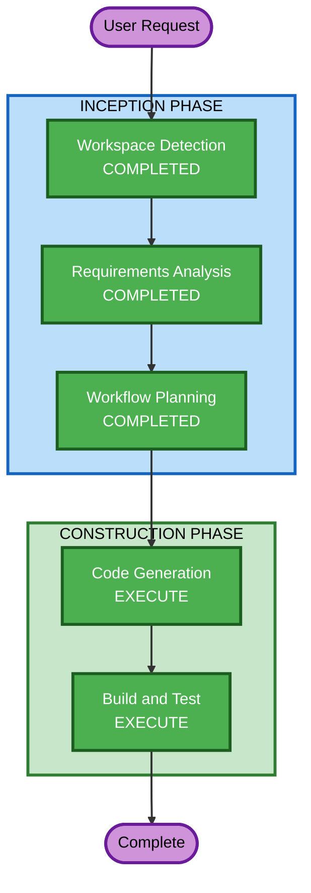

# Execution Plan - アバター表示On/Off機能

## Detailed Analysis Summary

### Change Impact Assessment
- **User-facing changes**: Yes - シナリオ設定UIにトグル追加、会話画面のレイアウト変更
- **Structural changes**: No - 既存コンポーネント構造の変更なし
- **Data model changes**: Yes - シナリオデータに `enableAvatar` フィールド追加（軽微）
- **API changes**: Yes - シナリオCRUD APIに `enableAvatar` フィールド追加（軽微）
- **NFR impact**: No - パフォーマンス・セキュリティへの影響なし

### Risk Assessment
- **Risk Level**: Low
- **Rollback Complexity**: Easy（フラグ追加のみ、既存機能への影響なし）
- **Testing Complexity**: Simple（条件分岐のテスト）

## Workflow Visualization



### Text Alternative
```
Phase 1: INCEPTION
- Workspace Detection (COMPLETED)
- Requirements Analysis (COMPLETED)
- Workflow Planning (COMPLETED)
- Reverse Engineering (SKIP)
- User Stories (SKIP)
- Application Design (SKIP)
- Units Generation (SKIP)

Phase 2: CONSTRUCTION
- Functional Design (SKIP)
- NFR Requirements (SKIP)
- NFR Design (SKIP)
- Infrastructure Design (SKIP)
- Code Generation (EXECUTE)
- Build and Test (EXECUTE)
```

## Phases to Execute

### INCEPTION PHASE
- [x] Workspace Detection (COMPLETED)
- [x] Reverse Engineering (SKIP - 既存成果物あり)
- [x] Requirements Analysis (COMPLETED)
- [x] User Stories (SKIP - 技術的な設定追加、ユーザーストーリー不要)
- [x] Workflow Planning (COMPLETED)
- [x] Application Design (SKIP - 既存コンポーネントへのフラグ追加のみ、新規コンポーネント不要)
- [x] Units Generation (SKIP - 単一ユニット、分割不要)

### CONSTRUCTION PHASE
- [x] Functional Design (SKIP - 単純なboolean条件分岐、複雑なビジネスロジックなし)
- [x] NFR Requirements (SKIP - 既存NFR設定で十分)
- [x] NFR Design (SKIP - NFR要件なし)
- [x] Infrastructure Design (SKIP - 既存インフラパターンの踏襲、DynamoDBフィールド追加のみ)
- [ ] Code Generation (EXECUTE)
  - **Rationale**: バックエンド・フロントエンド両方のコード変更が必要
- [ ] Build and Test (EXECUTE)
  - **Rationale**: リント・型チェック・動作確認が必要

## Estimated Timeline
- **Total Stages to Execute**: 2（Code Generation + Build and Test）
- **Estimated Duration**: 1-2時間

## Success Criteria
- シナリオ作成・編集画面でアバターOn/Offトグルが動作する
- アバターOFF時にVRMアップロードUIが非表示になる
- 会話画面でアバターOFF時にAvatarStageが非表示になりチャットログが拡大する
- 既存シナリオ（enableAvatar未設定）はアバターOFFとして動作する
- リントエラー0件、型エラー0件
- i18n対応（日英両言語）
