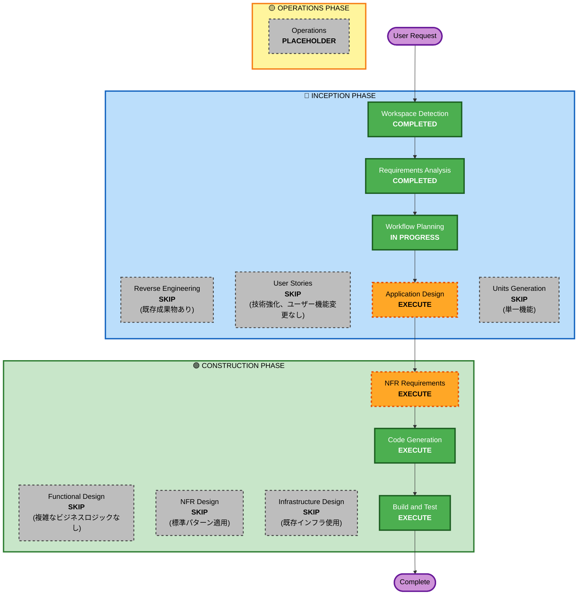

# Execution Plan - 3Dアバター機能

## 1. 詳細分析サマリー

### 1.1 変更スコープ
- **変更タイプ**: 機能強化（Enhancement）
- **主な変更**: フロントエンドに3Dアバターコンポーネントを追加、既存の絵文字フィードバックを置き換え
- **影響範囲**: フロントエンド中心、バックエンドは感情分析API拡張のみ

### 1.2 変更影響評価

| 影響領域 | 影響 | 詳細 |
|---------|------|------|
| ユーザー向け変更 | ✅ Yes | 会話画面のNPC表現が絵文字から3Dアバターに変更 |
| 構造変更 | ⚠️ 部分的 | 新規コンポーネント追加、既存コンポーネント置き換え |
| データモデル変更 | ✅ Yes | Scenarioにavatar関連フィールド追加 |
| API変更 | ✅ Yes | NPC応答に感情情報を追加 |
| NFR影響 | ✅ Yes | 3Dレンダリングによるパフォーマンス考慮必要 |

### 1.3 コンポーネント関係

```
影響を受けるコンポーネント:
├── frontend/
│   ├── components/
│   │   ├── avatar/ (新規)
│   │   │   ├── VRMAvatar.tsx
│   │   │   ├── VRMLoader.ts
│   │   │   ├── ExpressionController.ts
│   │   │   ├── LipSyncController.ts
│   │   │   └── AnimationController.ts
│   │   ├── conversation/
│   │   │   ├── EmojiFeedbackContainer.tsx (削除/置換)
│   │   │   └── ConversationPage統合
│   │   └── scenario/
│   │       └── シナリオ作成画面にアバター選択追加
│   ├── services/
│   │   ├── AvatarService.ts (新規)
│   │   └── PollyService.ts (Viseme対応拡張)
│   ├── types/
│   │   └── avatar.ts (新規)
│   └── public/models/avatars/ (VRMファイル配置)
├── cdk/
│   └── lambda/bedrock/ (感情分析拡張)
└── データ/
    └── シナリオテーブル (avatarIdフィールド追加)
```

### 1.4 リスク評価

| 項目 | 評価 |
|------|------|
| リスクレベル | **中** |
| ロールバック複雑度 | 低（フロントエンド中心のため） |
| テスト複雑度 | 中（3Dレンダリング、リップシンク検証） |

---

## 2. ワークフロー可視化



---

## 3. 実行フェーズ

### 🔵 INCEPTION PHASE

| ステージ | 状態 | 理由 |
|---------|------|------|
| Workspace Detection | ✅ COMPLETED | 完了 |
| Reverse Engineering | ⏭️ SKIP | 既存の成果物を使用 |
| Requirements Analysis | ✅ COMPLETED | 完了 |
| User Stories | ⏭️ SKIP | 技術強化であり、ユーザーワークフロー変更なし |
| Workflow Planning | 🔄 IN PROGRESS | 現在実行中 |
| Application Design | 🔜 EXECUTE | 新規コンポーネント設計が必要 |
| Units Generation | ⏭️ SKIP | 単一機能、分割不要 |

### 🟢 CONSTRUCTION PHASE

| ステージ | 状態 | 理由 |
|---------|------|------|
| Functional Design | ⏭️ SKIP | 複雑なビジネスロジックなし |
| NFR Requirements | 🔜 EXECUTE | 3Dレンダリングのパフォーマンス要件定義 |
| NFR Design | ⏭️ SKIP | 標準的なパターンを適用 |
| Infrastructure Design | ⏭️ SKIP | 既存インフラを使用、新規リソース不要 |
| Code Generation | 🔜 EXECUTE | 実装必須 |
| Build and Test | 🔜 EXECUTE | ビルド・テスト必須 |

### 🟡 OPERATIONS PHASE

| ステージ | 状態 | 理由 |
|---------|------|------|
| Operations | ⏸️ PLACEHOLDER | 将来の拡張用 |

---

## 4. 実装フェーズ計画

段階的実装（Q10回答: D）に基づく計画：

### Phase 1: MVP
- VRMモデルの基本表示
- 音量ベースのリップシンク
- 瞬きアニメーション
- 単一デフォルトアバター

### Phase 2: 標準実装
- Amazon Polly Visemeによる母音リップシンク
- AI感情分析による表情連動
- 複数アバター対応
- シナリオ管理統合

### Phase 3: 拡張（将来）
- より豊かなアニメーション
- アバターカスタマイズ機能

---

## 5. 見積もり

| 項目 | 値 |
|------|-----|
| 実行ステージ数 | 5 |
| スキップステージ数 | 7 |
| 推定期間 | Phase 1: 1-2週間、Phase 2: 2-3週間 |

---

## 6. 成功基準

1. 3Dアバターが会話画面に表示される
2. NPCの発言に合わせて口が動く（リップシンク）
3. NPCの感情に応じて表情が変化する
4. シナリオごとに異なるアバターを設定できる
5. 既存機能（音声認識、録画、評価）が正常に動作する
