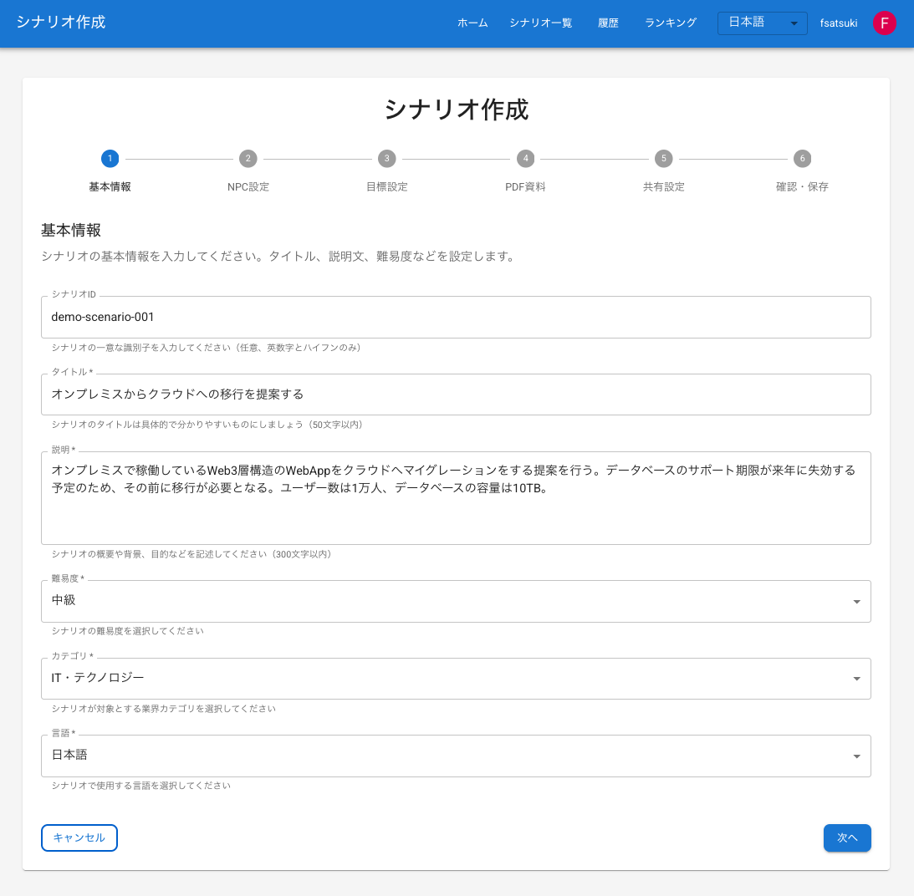
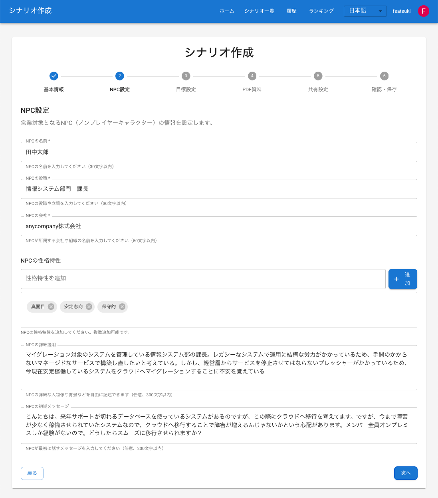
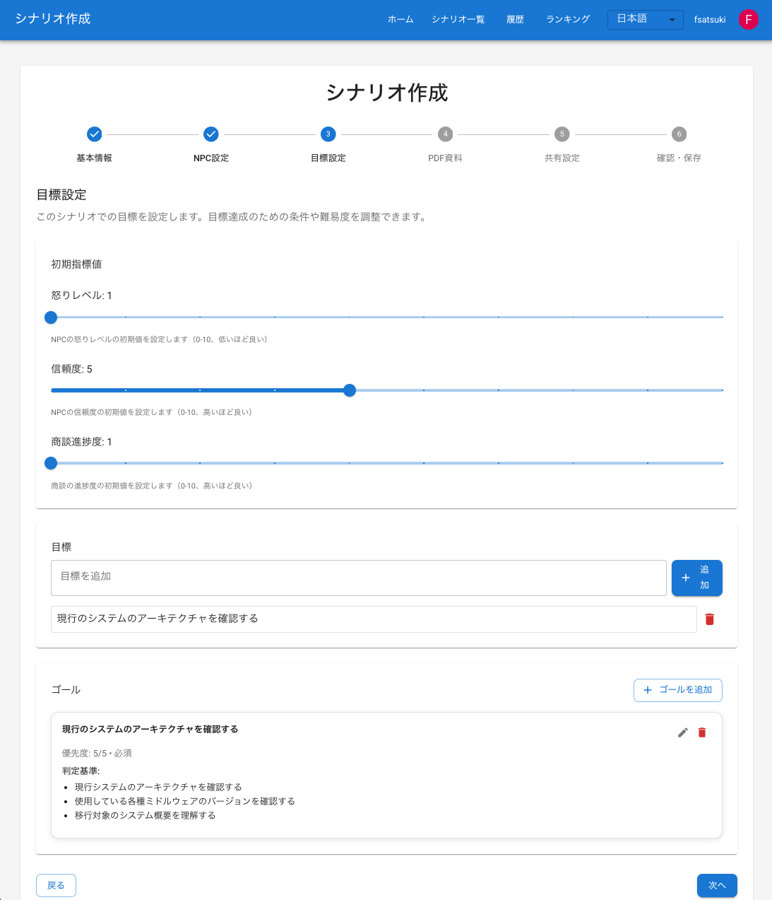
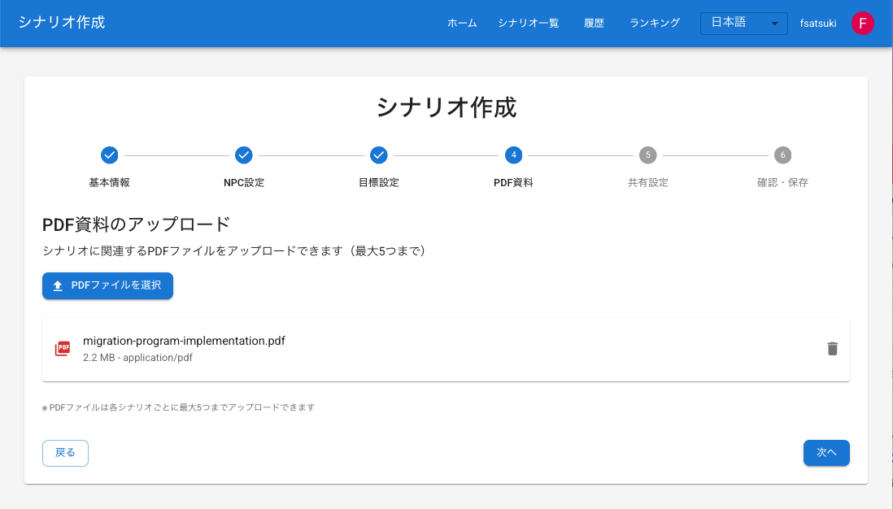
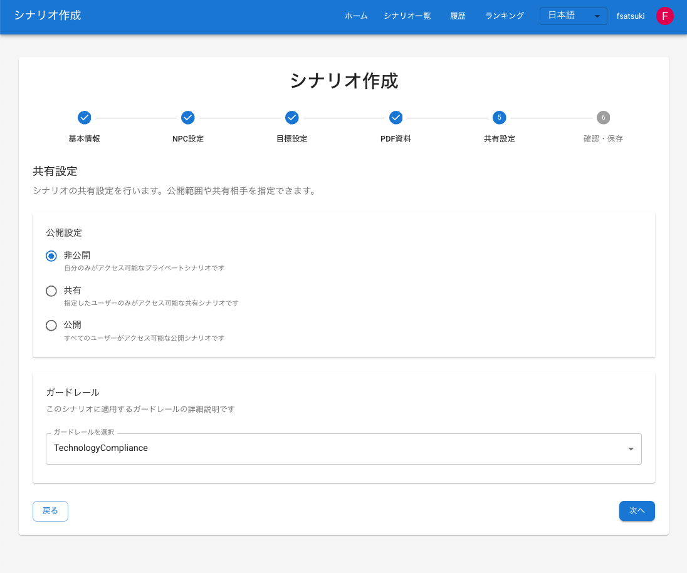
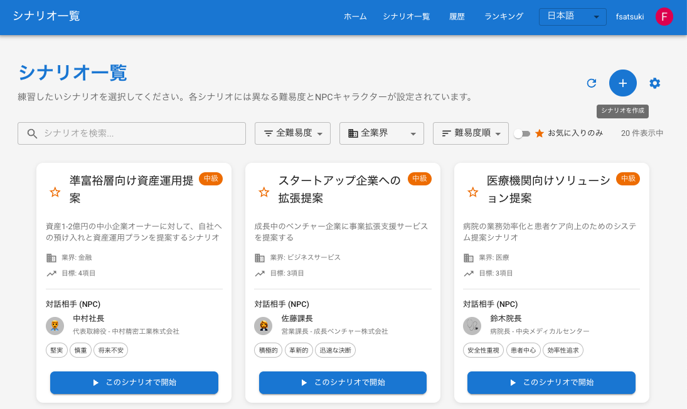
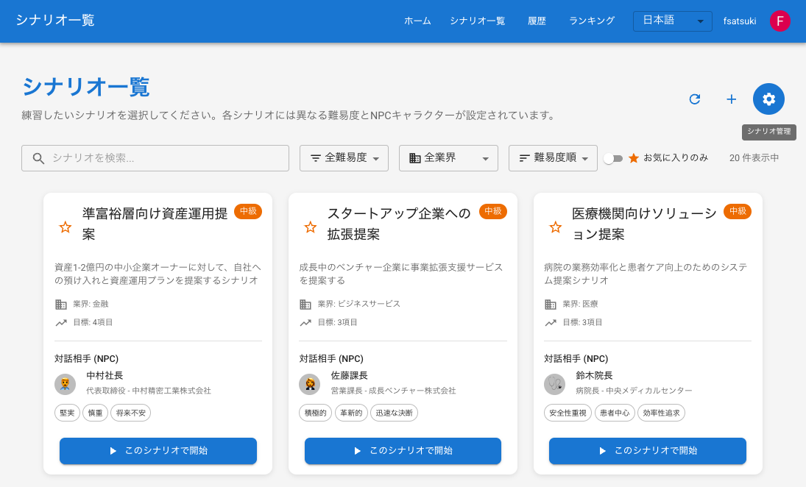
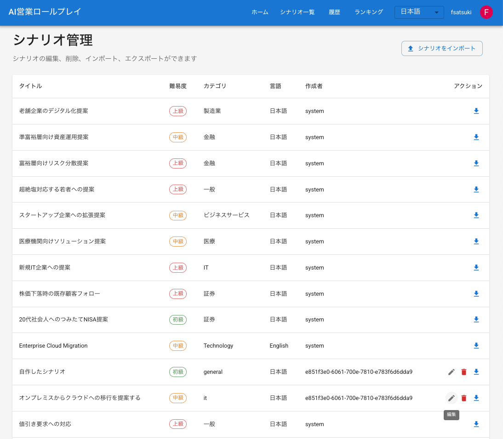

# シナリオ作成機能ドキュメント

## 概要

シナリオ作成機能は、ユーザーがカスタムシナリオを作成・編集・削除できるようにする機能です。多様な営業シナリオを柔軟に作成でき、ユーザー独自のトレーニングシナリオを実現します。

## 機能説明

### シナリオ作成機能

シナリオ作成は6つのステップで構成されています

1. **基本情報**
   - タイトル（必須、3～100文字）
   - 説明（必須、10～1000文字）
   - 難易度（簡単、普通、難しい、専門家向け）
   - カテゴリ（一般、IT、金融、医療、小売、製造業など）

2. **NPC情報**
   - 名前（必須、2～50文字）
   - 役職（必須、最大100文字）
   - 会社（必須、最大100文字）
   - 性格特性（複数選択可能）
   - 詳細説明（任意）

3. **目標設定**
   - 初期メトリクス（怒りメーター、信頼度、進捗度の初期値）
   - 目標リスト（営業セッションの目標）
   - ゴール設定（必須/オプション、優先度、達成条件）

4. **共有設定**
   - 公開範囲（全公開、非公開、特定ユーザーと共有）
   - 共有先ユーザー（公開範囲が「特定ユーザーと共有」の場合）
   - Guardrail設定（コンプライアンスルールセット）

5. **PDF資料**
   - リファレンスチェックの根拠となるPDFをアップロード

6. **プレビュー**
   - 作成したシナリオの全体確認
   - 保存前の最終確認

### シナリオ編集機能

作成したシナリオは後から編集できます

### シナリオ削除機能

不要になったシナリオは削除できます

## 使用方法

### シナリオの作成

シナリオは自然言語で自由に作成することが可能

シナリオを新規に作成する場合は、シナリオ一覧画面より「シナリオ作成」ボタン(+のアイコン)を押下する。

### シナリオの編集

作成したシナリオを更新する場合は、シナリオ一覧画面より「シナリオ管理」ボタン(歯車のアイコン)を押下する。

シナリオが一覧で表示される。編集する場合は「編集」ボタン(鉛筆のアイコン)、削除する場合は「削除」ボタン(ゴミ箱のアイコン)を押下する。  
シナリオは作成したオーナーのみが編集可能
