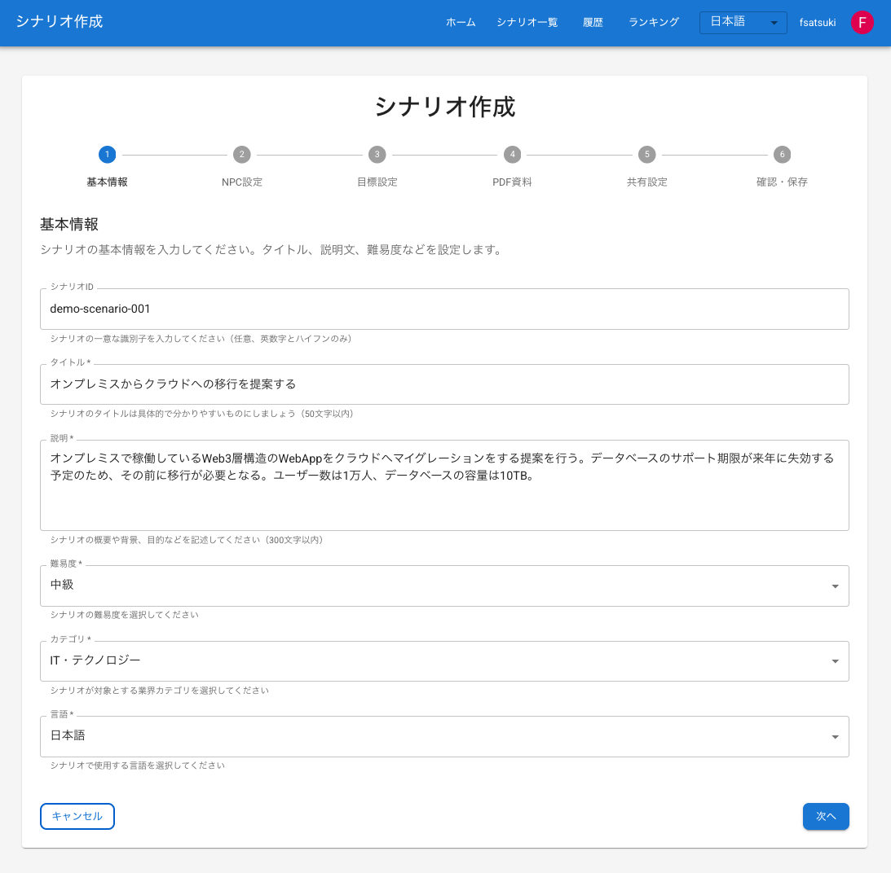
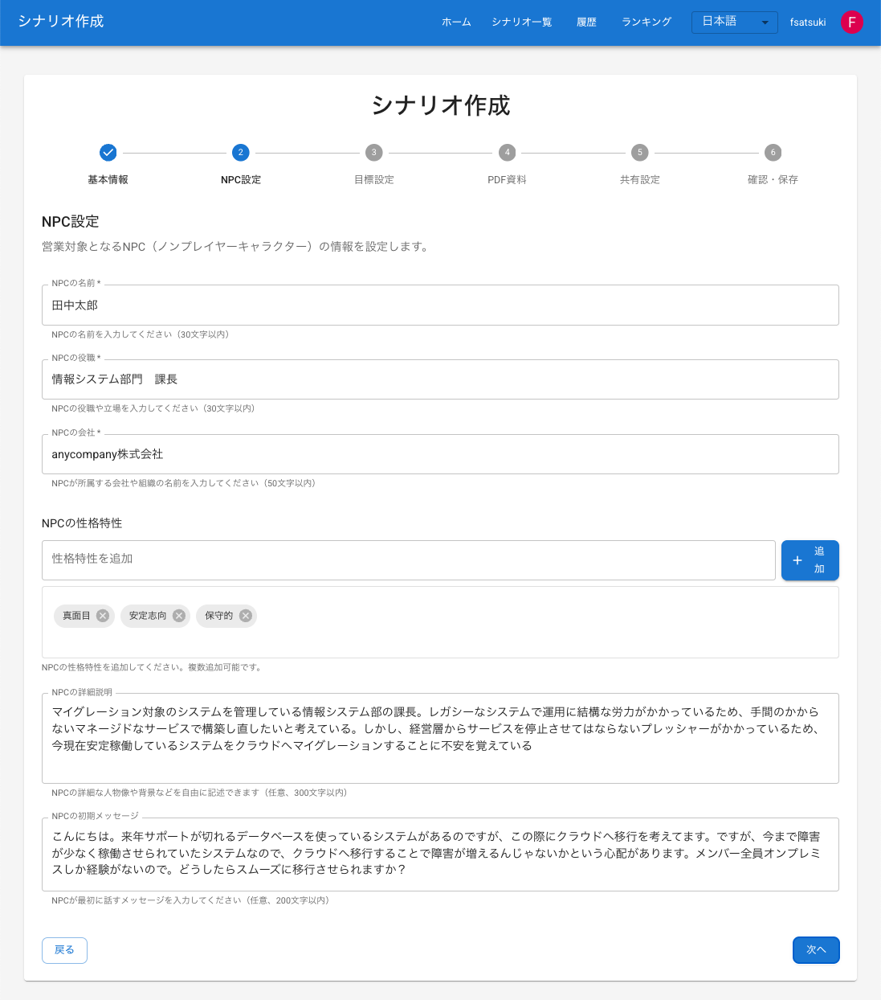
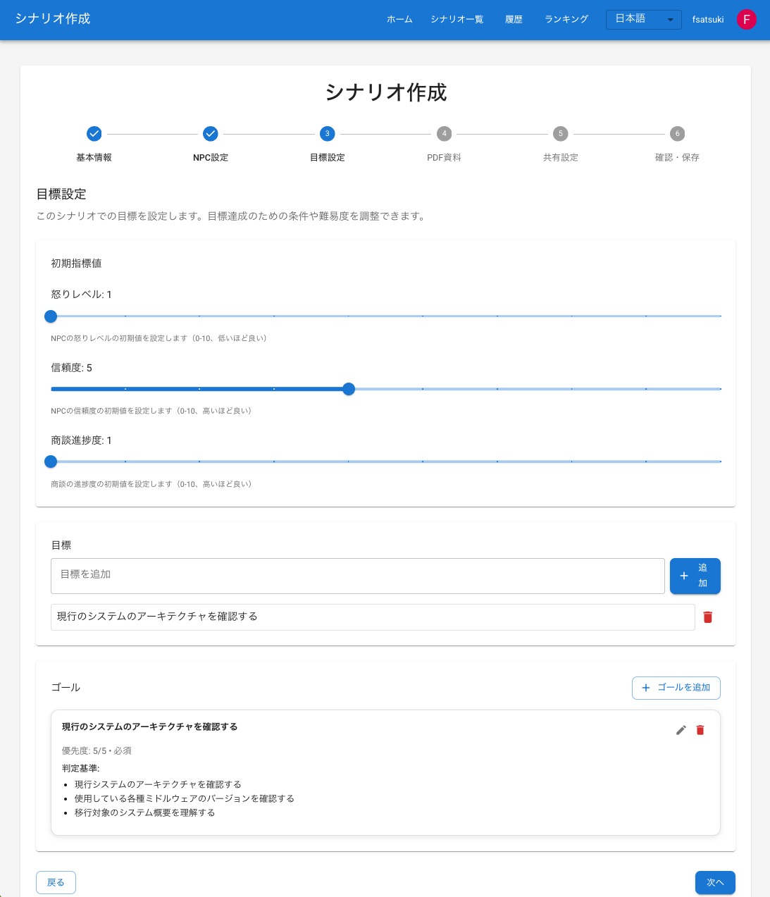
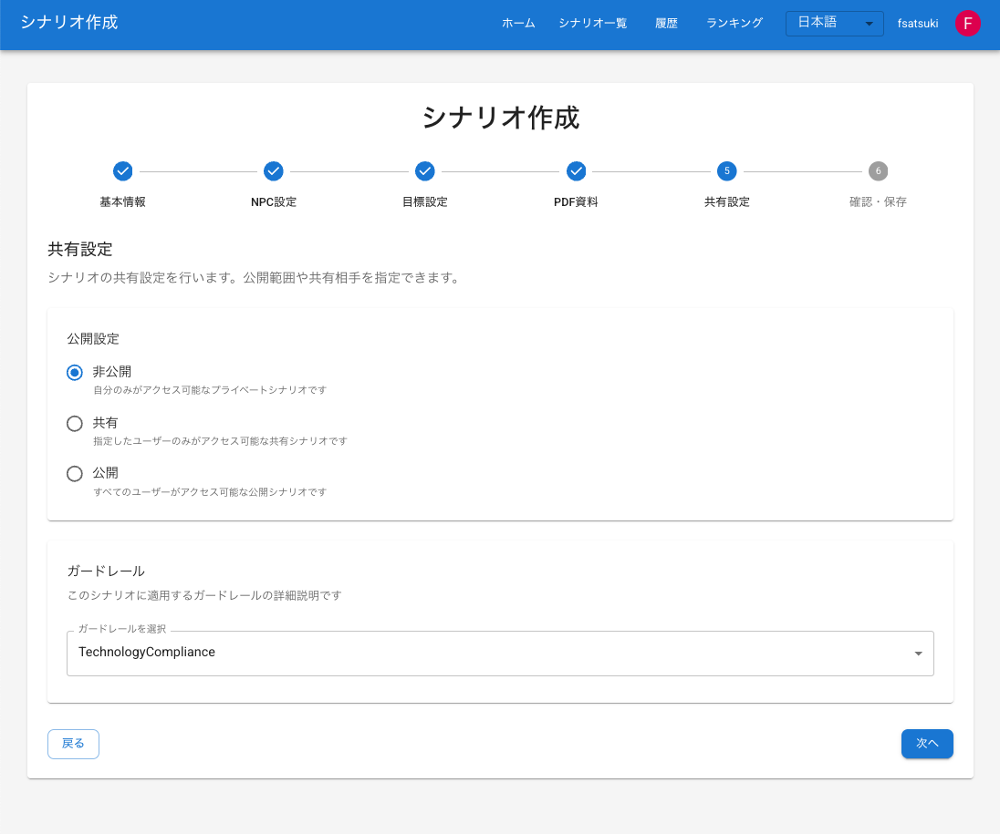
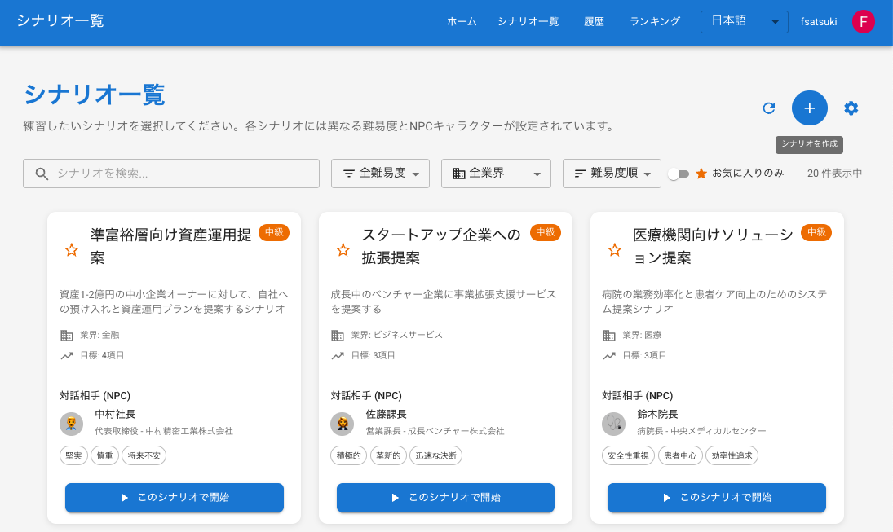
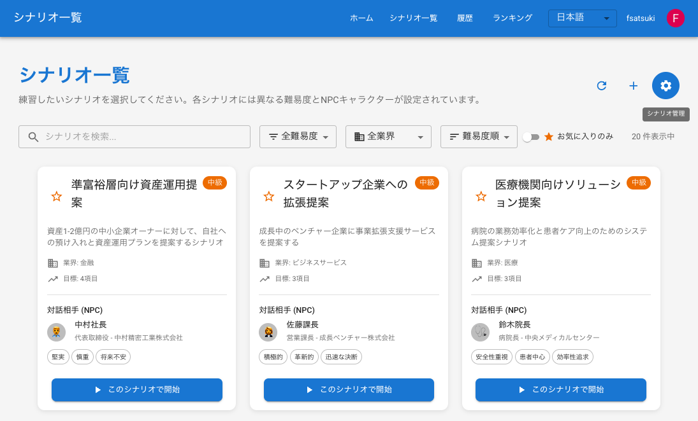
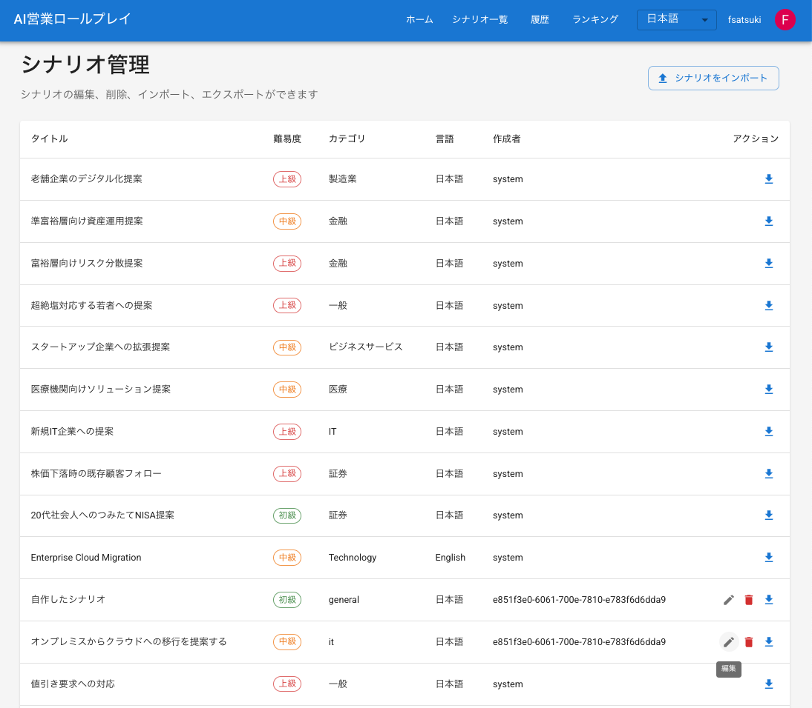

# シナリオ作成機能ドキュメント

## 概要

シナリオ作成機能は、ユーザーがカスタムシナリオを作成・編集・削除できるようにする機能です。多様な営業シナリオを柔軟に作成でき、ユーザー独自のトレーニングシナリオを実現します。

## 機能説明

### シナリオ作成機能

シナリオ作成は6つのステップで構成されています

1. **基本情報**
   - タイトル（必須、3～100文字）
   - 説明（必須、10～1000文字）
   - 難易度（簡単、普通、難しい、専門家向け）
   - カテゴリ（一般、IT、金融、医療、小売、製造業など）

2. **NPC情報**
   - 名前（必須、2～50文字）
   - 役職（必須、最大100文字）
   - 会社（必須、最大100文字）
   - 性格特性（複数選択可能）
   - 詳細説明（任意）

3. **目標設定**
   - 初期メトリクス（怒りメーター、信頼度、進捗度の初期値）
   - 目標リスト（営業セッションの目標）
   - ゴール設定（必須/オプション、優先度、達成条件）

4. **共有設定**
   - 公開範囲（全公開、非公開、特定ユーザーと共有）
   - 共有先ユーザー（公開範囲が「特定ユーザーと共有」の場合）
   - Guardrail設定（コンプライアンスルールセット）

5. **営業資料・評価設定**
   - **営業資料のアップロード**: 商品パンフレット、価格表、約款などの営業に使用する資料をPDFでアップロード（最大5つ）
   - **自動評価機能**: アップロードした資料を基に、営業セッション後に発言内容の正確性を自動評価
   - **リファレンスチェック**: ユーザーの発言が資料の内容と合っているかを確認し、不正確な情報提供を指摘
   - **具体例**: 
     - ✅ 適切: 「金利は1.2%です」（資料に1.2%と記載）
     - ⚠️ 要改善: 「金利は大体1-2%くらいです」（資料には1.2%と正確に記載されている）
     - ❌ 問題: 「がん保険は皮膚がんも対象です」（資料には皮膚がんは対象外と記載）

6. **プレビュー**
   - 作成したシナリオの全体確認
   - 保存前の最終確認

### シナリオ編集機能

作成したシナリオは後から編集できます。ただし、シナリオの種類によって編集権限が異なります。

### シナリオ削除機能

不要になったシナリオは削除できます。ただし、システムシナリオは削除できません。

## シナリオの権限管理

シナリオには3つの種類があり、それぞれ編集・削除の権限が異なります。

### シナリオの種類

| 種類 | `createdBy` | 説明 |
|---|---|---|
| システムシナリオ | `system` | CDKデプロイ時に `scenarios.json` から自動登録されるシナリオ。デモ用シナリオなどが該当 |
| デフォルトシナリオ | （なし） | `isCustom` が `false` の既存シナリオ。提案資料の更新のみ全ユーザーに許可 |
| カスタムシナリオ | ユーザーID | ユーザーが作成したシナリオ。作成者のみが編集・削除可能 |

### 権限マトリクス

| 操作 | システムシナリオ | デフォルトシナリオ | カスタムシナリオ（自分） | カスタムシナリオ（他人） |
|---|---|---|---|---|
| 閲覧・プレイ | 全ユーザー | 全ユーザー | 公開設定に依存 | 公開設定に依存 |
| 全フィールド編集 | 管理者のみ | 不可 | 可能 | 不可 |
| 提案資料の更新 | 管理者のみ | 全ユーザー | 可能 | 不可 |
| 削除 | 不可 | 不可 | 可能 | 不可 |

### 管理者ロール

システムシナリオの編集には管理者権限（Cognito `admin` グループ）が必要です。

#### 管理者グループの仕組み

- CDKデプロイ時に Cognito User Pool に `admin` グループが自動作成される
- バックエンド（Lambda）は IDトークンの `cognito:groups` クレームから管理者判定を行う
- フロントエンドは IDトークンの `cognito:groups` クレームを参照し、編集ボタンの表示を制御する

#### 管理者ユーザーの追加方法

AWS CLI を使用してユーザーを `admin` グループに追加します。

```bash
aws cognito-idp admin-add-user-to-group \
  --user-pool-id <USER_POOL_ID> \
  --username <USERNAME_OR_EMAIL> \
  --group-name admin
```

AWS Console から追加する場合:
1. Amazon Cognito コンソールを開く
2. 対象の User Pool を選択
3. 「ユーザー」タブから対象ユーザーを選択
4. 「グループ」タブで「ユーザーをグループに追加」を選択
5. `admin` グループを選択して追加

#### 管理者の確認方法

```bash
# グループに所属するユーザー一覧を取得
aws cognito-idp list-users-in-group \
  --user-pool-id <USER_POOL_ID> \
  --group-name admin
```

#### 管理者の削除方法

```bash
aws cognito-idp admin-remove-user-from-group \
  --user-pool-id <USER_POOL_ID> \
  --username <USERNAME_OR_EMAIL> \
  --group-name admin
```

## 使用方法

### シナリオの作成

シナリオは自然言語で自由に作成することが可能








シナリオを新規に作成する場合は、シナリオ一覧画面より「シナリオ作成」ボタン(+のアイコン)を押下する。


### シナリオの編集

作成したシナリオを更新する場合は、シナリオ一覧画面より「シナリオ管理」ボタン(歯車のアイコン)を押下する。


シナリオが一覧で表示される。編集する場合は「編集」ボタン(鉛筆のアイコン)、削除する場合は「削除」ボタン(ゴミ箱のアイコン)を押下する。  
シナリオは作成したオーナーのみが編集可能。システムシナリオは管理者（`admin` グループ所属ユーザー）のみ編集可能で、削除はできません。
